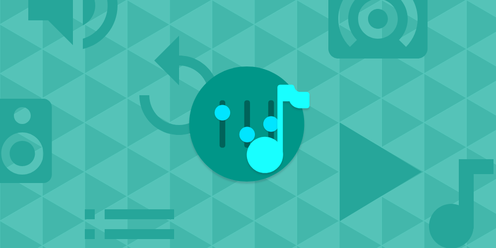

# Specta Player
An easy way to play audio on your spectacles  

## About

Have you played music on your spectacles from system music player? Yeah, it's a pain. I had too, so I present to you - an easier and more enjoyable way to do that!

Main focus of this app was to provide a beautful, fast and smooth experience for those who need it, even without internet connection.

## Contributing

- Fork the repo and start making your changes
- Test locally with `polymer serve` from [Polymer CLI](https://www.polymer-project.org/2.0/docs/tools/polymer-cli)
- Build everything using `npm run build`
- Upload your changes and test once again on your Github Pages (https://_yourusername_.github.io/specta-player/)
- Submit Pull Request 😃
